# Caltrans PeMS Traffic Analytics

When California locked down in March 2020, San Diego freeway congestion fell **66% in a single year** — and didn't fully recover for four years. This project pulls **12 years of Caltrans loop-detector data (≈133 million hourly rows)** into Snowflake and surfaces it in Tableau, so the question "where and when do Californians wait the longest in traffic?" can be answered with real numbers across the COVID era.

## Live demo

> _Tableau Public URL — coming soon (workbook is in `tableau/dashboard.twb`, will be published to Tableau Public for a clickable demo)._

## What the data shows

District 11 (San Diego region) freeway congestion, measured as total vehicle-hours of delay, with the free-flow reference set at 65 mph:

| Year | Hourly fact rows | Total delay (veh-hours) | Note |
|------|------------------|-------------------------|------|
| 2019 | 13.1 M | **30.0 M** | pre-COVID baseline |
| 2020 | 12.9 M | **10.3 M** | lockdown — **−66 % vs 2019** |
| 2021 | 12.1 M | 18.3 M | partial recovery |
| 2022 | 12.5 M | 19.8 M | |
| 2023 | 13.0 M | 25.0 M | |
| 2024 | 12.6 M | 24.8 M | ~83 % of pre-COVID |

Plus four other angles surfaced via SQL views in `ANALYTICS`:
- **District-month scorecard** — speed, delay, VMT by district and month
- **Holiday vs. non-holiday** — federal + CA holidays vs same-weekday baseline
- **Day vs. night patterns** — daylight/nighttime split using a sunrise-approximation flag on `dim_time_of_day`
- **Top bottlenecks** — stations ranked by cumulative delay, geocoded for map visuals
- **Wait-by-freeway-hour** — freeway × hour-of-day heatmap for spotting the AM/PM peak shape

## Architecture

End-to-end flow from raw Caltrans exports on a laptop, through Snowflake medallion-style layering, into Tableau. Solid arrows are batch hand-offs; dashed arrows are Airflow DAG tasks running in Snowflake.

```mermaid
flowchart LR
    pems[("Caltrans PeMS<br/>District 11 hourly exports<br/>2015 – 2026")]
    local["Local laptop<br/>data/station-hour/*.txt.gz<br/>data/metadata/*.txt"]

    subgraph staging ["Snowflake · STAGING schema"]
      direction TB
      stage1[("@STG_PEMS_FILES")]
      stage2[("@STG_PEMS_META_FILES")]
      raw["stg_pems_hour_raw"]
      dedup["stg_pems_hour_deduped"]
    end

    subgraph edw ["Snowflake · EDW schema (star)"]
      direction TB
      dims["dim_station (SCD2) · dim_freeway · dim_district<br/>dim_date · dim_holiday · dim_time_of_day"]
      fact[("fact_traffic_hour<br/>~133 M rows")]
      agg[("agg_traffic_daily<br/>daily rollup")]
    end

    subgraph ana ["Snowflake · ANALYTICS schema"]
      views["v_district_summary · v_wait_by_freeway_hour<br/>v_holiday_vs_normal · v_day_vs_night · v_top_bottlenecks"]
    end
    tableau["Tableau<br/>dashboards"]

    pems -->|manual download| local
    local -->|scripts/r3_backfill_year.sh<br/>SnowSQL PUT| stage1
    local -->|SnowSQL PUT| stage2
    stage1 -.->|Airflow · copy_pems_to_staging| raw
    raw -.->|Airflow · merge_staging_deduped| dedup
    dedup -.->|Airflow · scd2_dim_station<br/>+ merge_dim_freeway| dims
    stage2 -.->|enriches| dims
    dedup -.->|Airflow · load_fact_traffic_hour| fact
    dims --> fact
    fact -.->|Airflow · refresh_agg_traffic_daily| agg
    fact --> views
    agg --> views
    views --> tableau
```



## Tech stack

| Layer | Tool | Role here |
|-------|------|-----------|
| Warehouse | **Snowflake** | Dimensional model (SCD2 + Type 1), clustered hourly fact, daily rollup |
| Orchestration | **Apache Airflow 3.x** (Astro Runtime) | 8-task DAG: COPY INTO → dedupe → SCD2 → fact → rollup |
| Transform | **Snowflake Scripting procs** | Idempotent MERGE-style upserts for staging, dims, fact, rollup |
| Ingest | **SnowSQL `PUT`** via [`scripts/r3_backfill_year.sh`](scripts/r3_backfill_year.sh) | Multi-year + bash-3.2-portable backfill script with password prompt |
| BI | **Tableau Desktop + Tableau Public** | 5 curated views in `ANALYTICS` schema; extract-based for the hourly grain |
| Tests | **pytest** | DAG import, retries ≥ 2, tag presence |

## Data volume & runtime

| Metric | Value |
|--------|-------|
| Years covered | 2015-Dec → 2026-Apr (≈ 12 years of D11) |
| Raw exports uploaded | 125 hourly + 58 metadata files (~3.5 GB total) |
| Rows in `fact_traffic_hour` | **132,931,326** |
| Rows in `agg_traffic_daily` (rollup) | ≈ 5.5 M |
| Backfill DAG runtime (MEDIUM warehouse) | **≈ 3 minutes** end-to-end |
| Steady-state warehouse | X-SMALL (auto-suspend 300 s) |
| Source | [Caltrans PeMS](https://pems.dot.ca.gov) Station Hour exports — 30 s loop-detector aggregates rolled up to hourly |

The fact table is clustered on `(posted_date_sk, district_sk)` so common Tableau filters (year, district) prune partitions hard.

## Data model

```
                  ┌──────────────────────────┐
                  │  fact_traffic_hour       │
                  │  grain: station × hour   │◀─┐
                  │  + agg_traffic_daily     │  │
                  └──────────────────────────┘  │
                              │                 │
   ┌────────────────┬─────────┴──────┬──────────┴────────┬───────────────┐
   ▼                ▼                ▼                   ▼               ▼
dim_station    dim_freeway     dim_district        dim_date         dim_time_of_day
(SCD2)         (Type 1)        (12, seeded)        (calendar)       (24 rows)

                              dim_holiday (CA + federal 2022–2026)
```

Derived "wait" measures (computed in `load_fact_traffic_hour`):
```
delay_min_per_veh  = max( (1/avg_speed − 1/65) × length_mi × 60, 0 )
delay_veh_hours    = max( (1/avg_speed − 1/65) × length_mi × total_flow, 0 )
```
65 mph is the free-flow reference (typical CA mainline posted limit). The `max(…, 0)` clamps avoid negative delay when a station happens to exceed free-flow.

## Quick start (full backfill)

```bash
# 1. Register for PeMS at pems.dot.ca.gov (manual approval, 1–3 business days)
#    Download Station Hour exports for the year/district you want into:
#       data/station-hour/d11_text_station_hour_<year>_*.txt.gz
#       data/metadata/d11_text_meta_<year>_*.txt

# 2. Set up the Snowflake objects (idempotent — safe to re-run)
snowsql -c pems -f sql/01_setup.sql
snowsql -c pems -f sql/02_staging.sql
snowsql -c pems -f sql/02_dimensions_scd2.sql
snowsql -c pems -f sql/02_fact.sql
for f in sql/03_seed_*.sql sql/03_pipeline_*.sql; do snowsql -c pems -f "$f"; done
snowsql -c pems -f sql/04_views.sql

# 3. Upload the local files to the Snowflake stages
./scripts/r3_backfill_year.sh all          # or:  2024,  or:  2020-2024

# 4. Start Airflow and trigger the DAG
astro dev start                            # or:  docker compose up -d
# Then in the UI ( http://localhost:8080 , admin/admin) trigger pems_traffic_pipeline.
# Or from CLI:
docker exec <scheduler-container> airflow dags trigger pems_traffic_pipeline

# 5. Connect Tableau to TRAFFIC_PEMS_DB.ANALYTICS and refresh extracts.
```

For a no-Airflow manual run (useful for debugging) use [`scripts/r4_load_pipeline.sql`](scripts/r4_load_pipeline.sql) — same COPY INTO + proc calls inline.

## Local development

```bash
cp -n .env.example .env                    # then fill in AIRFLOW_CONN_SNOWFLAKE_DEFAULT
docker compose up --build -d               # Airflow UI at http://localhost:8080 (admin / admin)
pytest tests/                              # DAG import / tags / retries checks
```

### Deploy to Astronomer Cloud
The repo root is an Astro project (`.astro/config.yaml`). Use the root `Dockerfile` + `requirements.txt`:
```bash
astro login
astro deploy                               # or:  astro deploy <deployment-id>
```

## Repo layout

```
snowflake/
├── README.md
├── dags/pems_traffic_pipeline_dag.py     # 8-task Airflow DAG
├── sql/
│   ├── 01_setup.sql                       # Warehouse, DB, schemas, file formats, stages (DIRECTORY enabled)
│   ├── 02_staging.sql                     # stg_pems_hour_raw / deduped + station meta
│   ├── 02_dimensions_scd2.sql             # dim_station (SCD2), dim_freeway, dim_district, …
│   ├── 02_fact.sql                        # fact_traffic_hour + agg_traffic_daily rollup
│   ├── 03_seed_dim_date.sql               # Calendar 2015–2030 + sentinel
│   ├── 03_seed_dim_time_of_day.sql        # 24 hours, peak periods, daylight flag
│   ├── 03_seed_dim_district.sql           # 12 Caltrans districts
│   ├── 03_seed_dim_holiday.sql            # Federal + CA holidays 2022–2026
│   ├── 03_pipeline_ingest.sql             # merge_pems_staging_deduped procedure
│   ├── 03_pipeline_scd2_merge.sql         # SCD2 + dim_freeway procedures
│   ├── 03_pipeline_fact_load.sql          # Fact load + daily rollup procedures
│   └── 04_views.sql                       # ANALYTICS views for Tableau (full history)
├── scripts/
│   ├── r3_backfill_year.sh                # Multi-year SnowSQL PUT loader (bash 3.2 compatible)
│   └── r4_load_pipeline.sql               # Manual fallback when Airflow isn't available
├── tableau/dashboard.twb                  # Tableau Desktop workbook
├── tests/dags/                            # DAG import / tag / retries pytest
├── docs/PIPELINE_EXECUTION.md             # Long-form pipeline runbook
├── .astro/config.yaml                     # Astro project marker
├── Dockerfile                             # Astro Runtime 3.2 — for Astronomer / Astro Cloud
├── Dockerfile.local                       # apache/airflow:3.2 — for local docker-compose
├── docker-compose.yaml
├── requirements.txt                       # Astro image — provider deps
├── requirements-airflow.txt               # Local venv
└── requirements-airflow-docker.txt        # Local docker-compose image
```

## License

For academic use; adapt as needed for course requirements. Underlying data is © Caltrans and subject to the [PeMS terms of use](https://pems.dot.ca.gov).
